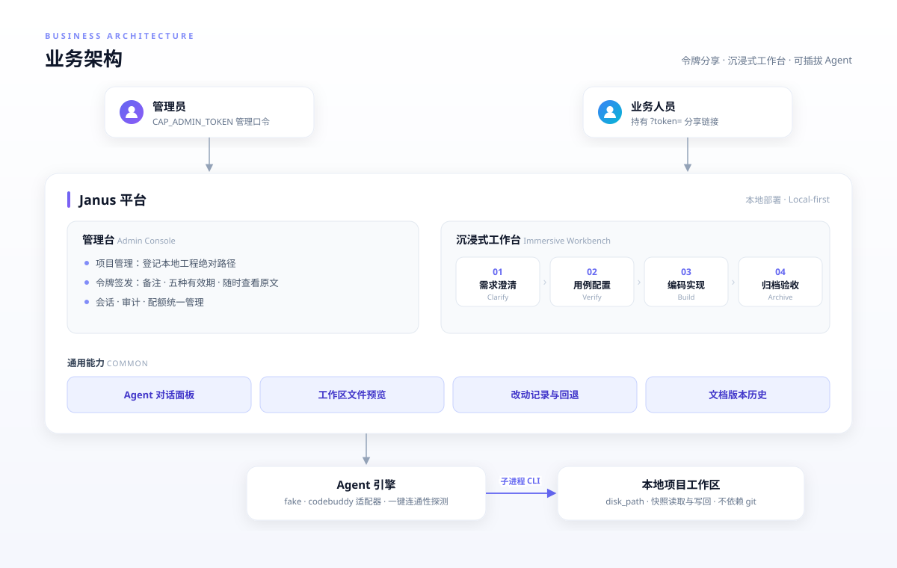
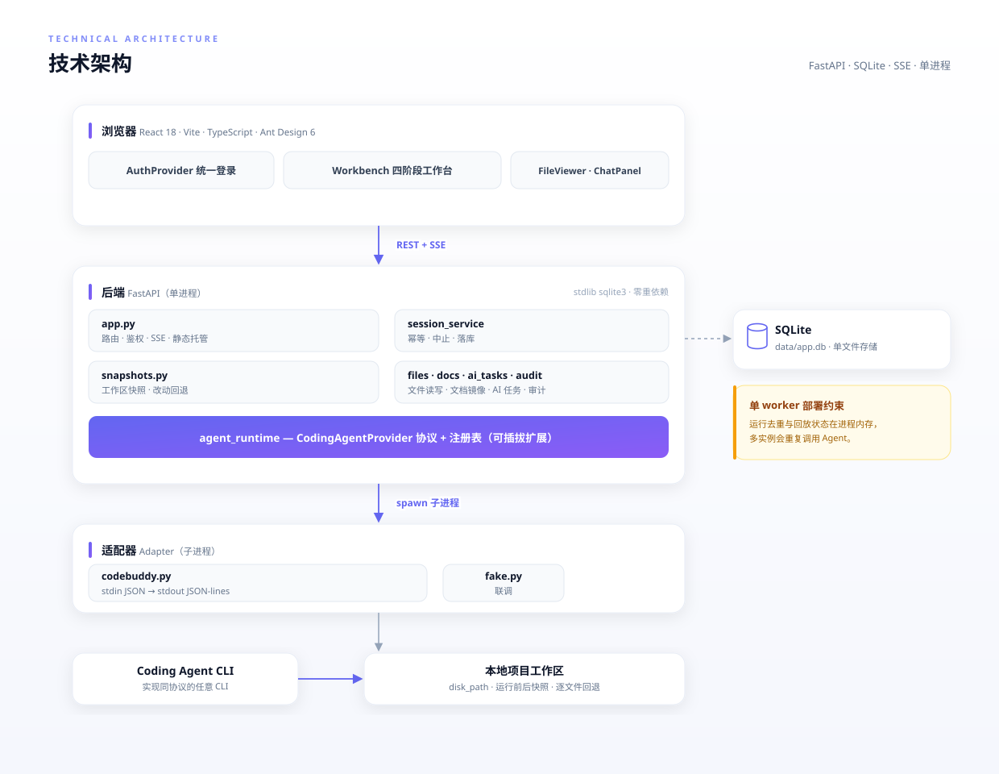
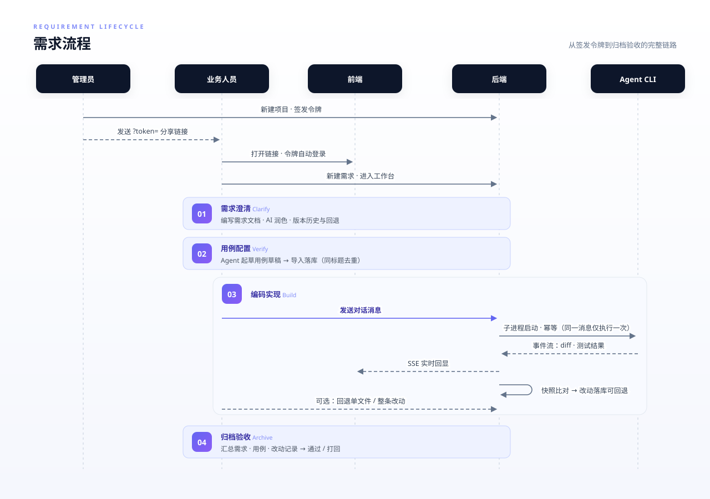
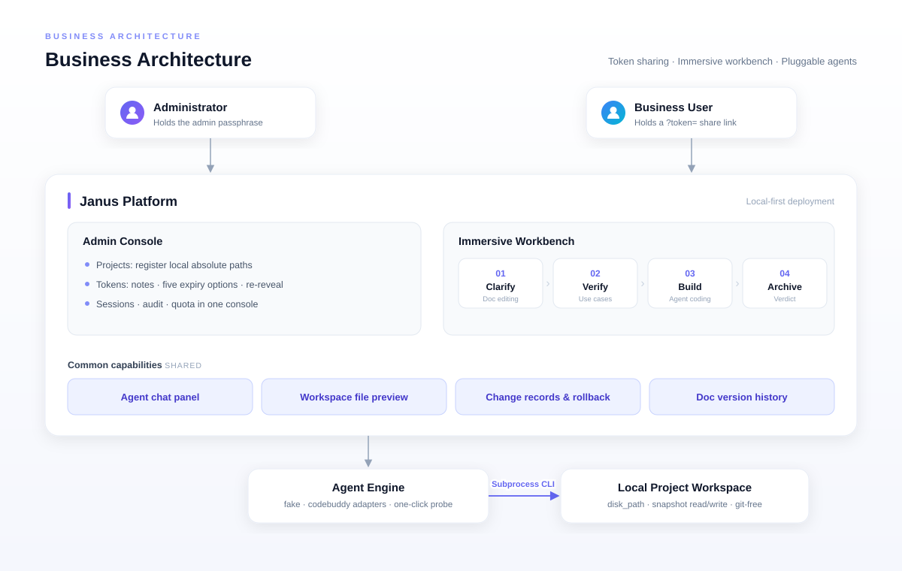
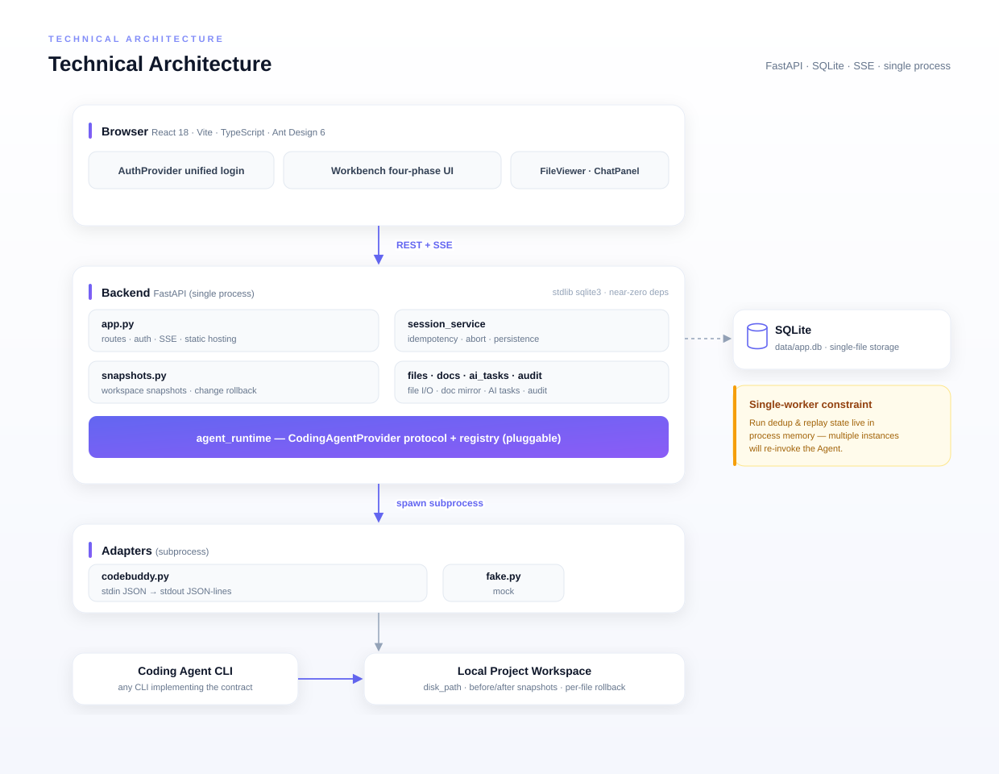
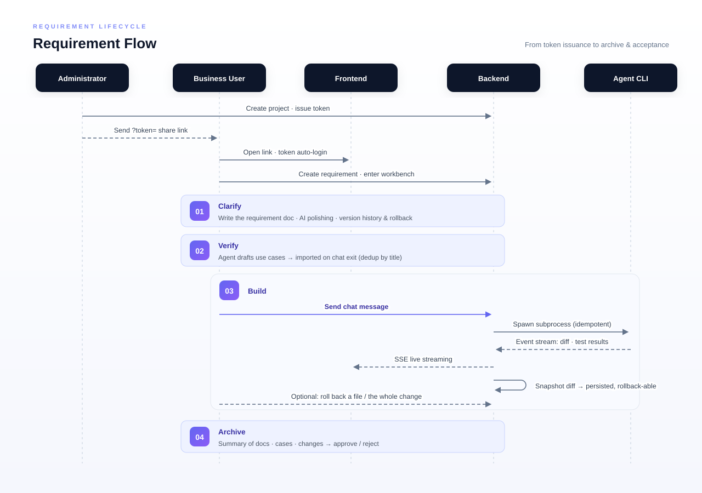

# Janus · Coding Agent Platform

<div align="center">

**简体中文** | [English](#english)

让业务人员通过一个带令牌的分享链接，在沉浸式工作台里用对话召唤 Coding Agent，直接修改项目代码。

Local web platform: share a tokenized link with non-developers, and they can summon a coding agent
via conversation in an immersive workbench to modify project code directly.

`FastAPI` · `SQLite` · `React 18` · `Vite` · `TypeScript` · `Ant Design 6` · `SSE`

</div>

---

## 简体中文

### 这是什么

Janus 是一个本地部署的 Web 平台，解决一个典型痛点：**业务人员有改需求，但不会（也不应该）直接碰代码仓库。**

管理员把本地项目登记到平台并签发访问令牌，业务人员拿到形如 `http://<局域网IP>:5173/?token=xxx` 的链接后，
无需账号体系即可进入项目空间，创建需求并进入**沉浸式工作台**：顶部是四阶段工作流
（需求澄清 → 用例配置 → 编码实现 → 归档验收），左栏随阶段切换（需求文档 / 用例 / 文件树与改动记录 / 归档汇总），
右栏始终是与 Coding Agent 的对话。Agent 的每次运行都会实时流式回显 diff 与测试结果，
平台在运行前后对工作区拍快照做比对，把实际改动落库为可回退的改动记录——**不依赖项目是 git 仓库**。

### 核心特性

- **四阶段需求工作流**：需求澄清（AI 润色、文档版本历史与行级对比回退）→ 用例配置（对话生成用例草稿、批量管理）→ 编码实现（文件树、逐文件/整条改动回退）→ 归档验收（汇总留痕、通过/打回结论）。
- **可插拔 Agent 引擎**：`CodingAgentProvider` 协议 + 注册表，内置 `fake`（联调）与 `codebuddy`（子进程调用 CodeBuddy CLI）适配器，可扩展 Cursor 等 CLI 型 agent。Agent 配置支持一键连通性探测（临时目录、超时强杀进程树）。
- **令牌分享与统一登录**：全站唯一登录弹框（令牌登录 / 管理员口令登录），令牌支持备注、五种有效期与随时查看原文；后端按令牌白名单过滤可见项目，目录访问做 `realpath` 前缀校验。
- **快照式改动记录与回退**：每次 Agent 运行前后各拍一张工作区快照，逐文件 diff 落库，支持回退单个文件或整条记录，回退本身也记一条 `revert`，随时可再回退。二进制与超大文件只记指纹、界面明示不可回退。
- **工作台文件预览**：xlsx / csv（SheetJS）、PDF、图片、docx（docx-preview）、HTML（sandbox iframe）、Markdown、代码语法高亮均可在线预览；纯文本可就地编辑。
- **运行中止与幂等**：真中止（进程树级终止），被中止的消息可重发；同一 `(session_id, message)` 运行中最多执行一次，SSE 断线重连自动回放、不重复改盘。
- **配额与审计**：Agent token 用量按**日**限额（用满当日不可用、次日自动重置），管理员可查审计日志与调用明细。
- **管理台**：项目、令牌、会话的统一管理入口，解决「第一枚令牌从哪来」的问题。

### 架构图

**业务架构** —— 两类角色与平台能力：



**技术架构** —— 从浏览器到磁盘的完整链路：



**一次需求的完整流程**：



### 技术栈

| 层 | 选型 |
| --- | --- |
| 后端 | Python 3.11+ / FastAPI / stdlib `sqlite3`（零重依赖）/ SSE |
| 前端 | React 18 / Vite / TypeScript / Ant Design 6 |
| 存储 | 单文件 SQLite（`data/app.db`），产物 `web/dist` 由后端静态托管 |

### 快速开始

Windows 下一键脚本搞定（在 `coding-agent-platform` 目录下）：

```bash
cd coding-agent-platform
manage.bat build      # 构建 web/dist 并启动后端，访问 http://localhost:8000（生产模式，推荐）
manage.bat dev        # 开发模式：后端 :8000 + Vite 热更新 :5173
manage.bat stop       # 停止服务
manage.bat status     # 查看运行状态
```

首次运行前准备一次依赖即可：

```bash
cd coding-agent-platform
python -m venv .venv
.venv\Scripts\pip install -r requirements.txt    # Linux/macOS: .venv/bin/pip
cd web && npm install && cd ..
```

生产环境启动前配置管理员口令：

```bash
echo CAP_ADMIN_TOKEN=your-admin-secret > coding-agent-platform\.env
```

> Linux / macOS 没有 `manage.bat`：在 `coding-agent-platform` 下执行 `npm run build` 后运行 `python start.py`（后端单进程托管 `web/dist`）。

### 使用流程

1. 打开页面 → 登录弹框选 **管理员登录**，输入 `.env` 中的口令。
2. 进入 **管理台** → 新建项目（填写本地磁盘绝对路径）→ 签发令牌，复制 `?token=` 分享链接。
3. **Agent 管理** 注册至少一个 agent：`fake`（config 填 `{}`，联调用）或 `codebuddy`
   （config 填 `{"cmd":"codebuddy","args":[]}`），点 **测试** 验证连通性。
4. 把分享链接发给业务人员 → 其进入项目空间 → 新建需求 → 进入工作台，四阶段走完需求。

### 测试

```bash
python backend/tests/run_all.py           # 单元测试
python tools/smoke_workflow_api.py        # 工作流 HTTP 冒烟（自起 uvicorn + 桩 agent）
python tools/smoke_versions_api.py        # 版本历史与改动回退冒烟
python tools/smoke_file_api.py            # 文件接口冒烟
python tools/smoke_agent_probe.py         # Agent 探测冒烟（替身适配器）
node tools/ui_smoke_workbench.mjs "http://127.0.0.1:8000/?token=<令牌>#/workbench/<会话id>"
node tools/ui_smoke_auth.mjs http://127.0.0.1:8000 <管理员口令>
```

### 目录结构

```
docs/images/               # 架构图（zh/ 中文版 · en/ 英文版，SVG）
coding-agent-platform/
├── backend/
│   ├── app.py               # 路由、鉴权、SSE、静态托管
│   ├── agent_runtime.py     # AgentEvent / Provider 协议 / 注册表
│   ├── adapters/            # fake.py、codebuddy.py（子进程适配器，含环境变量清洗）
│   ├── session_service.py   # 会话调用 agent + 幂等 + 落库
│   ├── snapshots.py         # 工作区快照、前后比对、逐文件回退（不依赖 git）
│   ├── files.py / docs.py / ai_tasks.py / audit.py ...
│   └── tests/               # 自研测试套件（python backend/tests/run_all.py）
├── web/src/
│   ├── pages/               # Dashboard / ProjectList / RequirementList / Workbench / AgentList / AdminConsole
│   └── components/          # AuthProvider / AuthLoginModal / FileViewer / ChangePane / ChatPanel ...
├── tools/                   # HTTP / UI 冒烟脚本
├── start.py                 # 一键启动入口
└── requirements.txt
```

### 部署注意

> ⚠️ **必须单进程 / 单 worker 部署。** 运行去重与断线回放状态保存在进程内存中，
> 多 worker 会导致重复调用 agent。如需水平扩展，需将运行态外置（Redis / DB 行锁）。

- 未配置 `CAP_ADMIN_TOKEN` 时后端为**开放模式**：任何能访问端口的人都可调用管理端点，生产环境务必配置口令。
- `Config.db_path` 默认指向 `data/app.db`；数据目录请纳入备份策略。

### 接入自定义 Agent CLI

`codebuddy` 适配器以子进程方式启动 CLI，约定如下（实现同协议即可接入任意 CLI agent）：

- **stdin** 传入 JSON：`{"message": "...", "project_path": "..."}`
- **stdout** 每行一个 `AgentEvent` JSON（JSON-lines）：
  `{"type":"message|edit|test|status|error", "pane":"message|code|test", "text":"...", "payload":{...}}`
- `pane:"code"` 的事件触发平台计算 diff 并展示；`pane:"test"` 建议带 `payload:{"cmd":"...","passed":true,"output":"..."}`

---

<a id="english"></a>

## English

### What is this

Janus is a locally deployed web platform that solves a classic pain point: **business people need changes, but shouldn't touch the codebase directly.**

An admin registers local projects and issues access tokens. Stakeholders open a link like
`http://<LAN-IP>:5173/?token=xxx` — no account system needed — enter the project space, create a requirement,
and step into the **immersive workbench**: a four-phase workflow on top
(requirement clarification → use case configuration → coding → archive & acceptance), a left pane that
switches per phase (requirement doc / use cases / file tree & change records / archive summary), and a
chat panel with the coding agent on the right. Every agent run streams diffs and test results in real time.
The platform snapshots the workspace before and after each run and persists the actual changes as
rollback-able change records — **no git repository required**.

### Key Features

- **Four-phase requirement workflow**: clarify (AI polishing, doc version history with line-level diff & rollback) → verify (agent-drafted use cases, batch management) → build (file tree, per-file / whole-record change rollback) → archive (summary, approve / reject verdict).
- **Pluggable agent engine**: `CodingAgentProvider` protocol + registry, with built-in `fake` (for integration testing) and `codebuddy` (subprocess wrapper for the CodeBuddy CLI) adapters; extensible to Cursor and other CLI agents. One-click connectivity probe with temp-dir isolation and process-tree cleanup.
- **Token sharing & unified login**: a single login modal site-wide (token login / admin passphrase login); tokens support notes, five expiry options and re-reveal; the backend filters visible projects by token whitelist and enforces `realpath` prefix checks on directory access.
- **Snapshot-based change tracking & rollback**: before/after workspace snapshots per agent run, per-file diffs persisted; roll back a single file or an entire record — and the rollback itself is recorded as a `revert`, so you can always roll back again. Binary and oversized files only record fingerprints, clearly marked as non-restorable.
- **Workbench file preview**: xlsx / csv (SheetJS), PDF, images, docx (docx-preview), HTML (sandboxed iframe), Markdown, and syntax-highlighted code render in-browser; plain text files are editable in place.
- **Abort & idempotency**: real abort (process-tree kill); aborted messages can be resent; a given `(session_id, message)` runs at most once per run — SSE reconnects replay recorded events instead of re-invoking the agent.
- **Quota & audit**: agent token usage is capped **per day** (exhausted today, auto-reset tomorrow); admins can browse audit logs and invocation details.
- **Admin console**: unified management for projects, tokens and sessions — solving "where does the first token come from".

### Architecture

**Business architecture** — two roles and platform capabilities:



**Technical architecture** — the full path from browser to disk:



**Lifecycle of one requirement**:



### Tech Stack

| Layer | Choice |
| --- | --- |
| Backend | Python 3.11+ / FastAPI / stdlib `sqlite3` (near-zero deps) / SSE |
| Frontend | React 18 / Vite / TypeScript / Ant Design 6 |
| Storage | Single-file SQLite (`data/app.db`); `web/dist` served statically by the backend |

### Quick Start

On Windows, one script does everything (inside `coding-agent-platform/`):

```bash
cd coding-agent-platform
manage.bat build      # Build web/dist and start the backend at http://localhost:8000 (production mode, recommended)
manage.bat dev        # Dev mode: backend :8000 + Vite hot reload :5173
manage.bat stop       # Stop services
manage.bat status     # Show running status
```

One-time dependency setup before the first run:

```bash
cd coding-agent-platform
python -m venv .venv
.venv\Scripts\pip install -r requirements.txt    # Linux/macOS: .venv/bin/pip
cd web && npm install && cd ..
```

For production, set the admin passphrase before starting:

```bash
echo CAP_ADMIN_TOKEN=your-admin-secret > coding-agent-platform\.env
```

> Linux / macOS (no `manage.bat`): inside `coding-agent-platform`, run `npm run build`, then `python start.py` (the backend serves `web/dist` in a single process).

### Usage

1. Open the app → pick **Admin login** in the login modal, enter the passphrase from `.env`.
2. Admin console → create a project (local absolute path) → issue a token, copy the `?token=` share link.
3. Register at least one agent under **Agents**: `fake` (config `{}`, for testing) or `codebuddy`
   (config `{"cmd":"codebuddy","args":[]}`), then hit **Test** to verify connectivity.
4. Send the share link to stakeholders → they create requirements and run the four-phase workflow in the workbench.

### Testing

```bash
python backend/tests/run_all.py           # Unit tests
python tools/smoke_workflow_api.py        # Workflow HTTP smoke (spins up uvicorn + stub agent)
python tools/smoke_versions_api.py        # Version history & change rollback smoke
python tools/smoke_file_api.py            # File API smoke
python tools/smoke_agent_probe.py         # Agent probe smoke (fake adapters)
node tools/ui_smoke_workbench.mjs "http://127.0.0.1:8000/?token=<token>#/workbench/<sessionId>"
node tools/ui_smoke_auth.mjs http://127.0.0.1:8000 <admin-passphrase>
```

### Project Layout

```
docs/images/               # Diagrams (zh/ Chinese · en/ English, SVG)
coding-agent-platform/
├── backend/
│   ├── app.py               # Routes, auth, SSE, static hosting
│   ├── agent_runtime.py     # AgentEvent / Provider protocol / registry
│   ├── adapters/            # fake.py, codebuddy.py (subprocess adapter, env sanitization)
│   ├── session_service.py   # Session invocation + idempotency + persistence
│   ├── snapshots.py         # Workspace snapshots, diffing, per-file rollback (git-free)
│   ├── files.py / docs.py / ai_tasks.py / audit.py ...
│   └── tests/               # Self-contained test suite (python backend/tests/run_all.py)
├── web/src/
│   ├── pages/               # Dashboard / ProjectList / RequirementList / Workbench / AgentList / AdminConsole
│   └── components/          # AuthProvider / AuthLoginModal / FileViewer / ChangePane / ChatPanel ...
├── tools/                   # HTTP / UI smoke scripts
├── start.py                 # One-click entrypoint
└── requirements.txt
```

### Deployment Notes

> ⚠️ **Single process / single worker only.** Run dedup and replay state live in process memory;
> multiple workers will re-invoke the agent. For horizontal scaling, externalize the run state (Redis / DB row locks).

- Without `CAP_ADMIN_TOKEN` the backend runs in **open mode**: anyone with port access can hit admin endpoints. Always set a passphrase in production.
- `Config.db_path` defaults to `data/app.db`; include the data directory in your backup strategy.

### Integrating a Custom Agent CLI

The `codebuddy` adapter launches a CLI as a subprocess. Implement the same contract to plug in any CLI agent:

- **stdin** receives JSON: `{"message": "...", "project_path": "..."}`
- **stdout** emits one `AgentEvent` JSON per line (JSON-lines):
  `{"type":"message|edit|test|status|error", "pane":"message|code|test", "text":"...", "payload":{...}}`
- Events with `pane:"code"` trigger platform-side diff computation; `pane:"test"` events should carry
  `payload:{"cmd":"...","passed":true,"output":"..."}`

---

<div align="center">

Made with 🍵 · Janus

</div>
